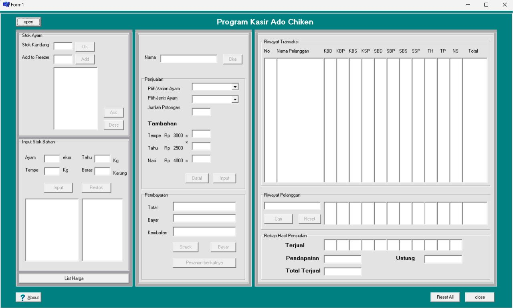

## About

The Adatong cashier program is a program aimed at UMKM in Indonesia,
especially in selling chicken restaurants. The program consists of inputting material stock, sales, payments,
transaction history and customer data. The features in this program use the bubble sort algorithm in sorting, 
and use sequential search in searching. This program only uses static array data structures and primitive data types. 
This program is made using the C++ language and uses the Borland Delphi 6 C++ GUI for its IDE. This program is 
a major assignment from the Basic Programming course based on Graphical User Interface (GUI) in Systems information 
at Andalas University with supporting lecturers Prof. Surya Afnarius, M.Sc, Ph.D.

## Tech
C++, Borland Delphi C++ 6

## GUI Project
This image is taken using [community visualizer](https://entelect-replay.raezor.co.za/)

## How to Use
